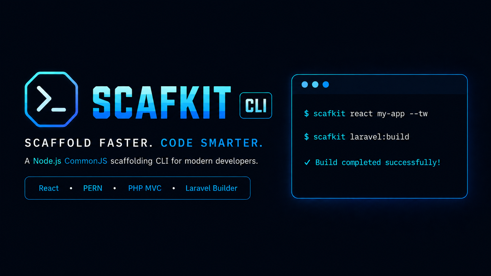

# Scafkit CLI

[](https://www.npmjs.com/package/scafkit-cli)
[](https://badge.socket.dev/npm/package/scafkit-cli/1.0.9)
[](#license)

Scafkit CLI is a practical project scaffolding and build helper for PHP MVC, PERN, React, and Laravel workflows. It helps you create starter projects, add PHP MVC files, run local projects, inspect tooling, and package Laravel apps for deployment.

## Links

- Repository: https://github.com/RaileySawada/scafkit-cli
- Bugs: https://github.com/RaileySawada/scafkit-cli/issues
- Homepage: https://github.com/RaileySawada/scafkit-cli#readme
- npm: https://www.npmjs.com/package/scafkit-cli

## Install

```bash
npm install -g scafkit-cli
```

Start the interactive shell:

```bash
scafkit
```

Run a direct command:

```bash
scafkit react dashboard --tw
```

## What You Can Do

| Need                               | Command                                                    |
| ---------------------------------- | ---------------------------------------------------------- |
| Create a React app                 | `scafkit react my-app`                                     |
| Create a PERN app                  | `scafkit pern inventory --sq-pg --tw`                      |
| Create a PHP MVC auth starter      | `scafkit php auth-app`                                     |
| Add a PHP MVC controller           | `scafkit make:controller Invoice approve reject`           |
| Add a PHP MVC route                | `scafkit make:route GET /invoices InvoiceController@index` |
| Build a Laravel app for deployment | `scafkit laravel:build`                                    |
| Inspect the current project        | `scafkit inspect`                                          |
| Check local tooling                | `scafkit doctor`                                           |
| Start a local dev server           | `scafkit run`                                              |
| Check for CLI updates              | `scafkit update --check`                                   |

## Project Starters

### React

```bash
scafkit react client-app
scafkit react client-app --tw
scafkit react client-app --js --no-install
scafkit react client-app --serverless --tw --pm pnpm
```

Creates a Vite React project with a scalable `src` layout. TypeScript is the default, JavaScript is available with `--js`, and Tailwind or Netlify Functions can be added with flags.

### PERN

```bash
scafkit pern inventory --sq-pg --tw
scafkit pern inventory --sq-mysql --js
scafkit create pern inventory --sq-pg --dir ../projects --yes
```

Creates a separated React client and Express API. Sequelize dialect flags are available for PostgreSQL, MySQL, SQLite, MariaDB, and Microsoft SQL Server.

### PHP MVC

```bash
scafkit php auth-app
scafkit php auth-app --tw
scafkit php auth-app --bs
```

Creates a PHP MVC authentication starter with controllers, models, routes, sessions, `.env.example`, and SQL schema.

## Laravel Build

Run this from the root of an existing Laravel app:

```bash
scafkit laravel:build
```

Inside the interactive shell, use:

```bash
laravel:build
```

Scafkit checks that the current folder is a Laravel project, then quietly verifies Composer and Laravel before building.

It runs the production build sequence:

```bash
composer install --no-dev --optimize-autoloader
npm install
npm run build

php artisan config:clear
php artisan route:clear
php artisan view:clear
php artisan cache:clear

php artisan config:cache
php artisan route:cache
php artisan view:cache
php artisan event:cache
```

It creates the deployment folder inside the current Laravel project root. The folder name comes from `APP_NAME` and uses a `-build` suffix, such as `e-docs-build` or `edocs-build`. If the target already exists, Scafkit picks the next available suffix such as `e-docs-build-1`.

Generated layout:

```text
your-app-build/
├─ .htaccess
├─ your_database_name.sql
├─ public/
│  └─ index.php
└─ laravel-app/
   ├─ app/
   ├─ bootstrap/
   ├─ config/
   ├─ database/
   ├─ resources/
   ├─ routes/
   ├─ storage/
   ├─ vendor/
   └─ .env
```

The build excludes local development files such as `node_modules`, `tests`, public source maps, debug logs, package files, and Vite/Tailwind config files.

For Laravel storage, Scafkit keeps the normal Laravel folder structure and `.gitignore` files. It only excludes these generated runtime files:

```text
storage/logs/laravel.log
storage/framework/views/*.php
```

For Laravel bootstrap cache, Scafkit keeps `bootstrap/cache/.gitignore` and excludes generated PHP cache files:

```text
bootstrap/cache/*.php
```

Scafkit also updates `laravel-app/.env` for deployment defaults:

```env
APP_ENV=production
APP_DEBUG=false
APP_URL=https://your.domain.example
DB_CONNECTION=mysql
SESSION_DRIVER=database
CACHE_STORE=database
```

Before exporting SQL, Scafkit checks Laravel migrations for the `cache`, `cache_locks`, and `sessions` tables. If the migrations are missing, it creates them with Artisan, runs `php artisan migrate --force`, and exports the current MySQL/MariaDB database with `mysqldump`. The SQL dump is stored in the build root beside `.htaccess`, and its filename is the exact `DB_DATABASE` value from `.env`.

After upload, edit `laravel-app/.env` with the real production domain and database credentials.

## Common Flags

| Flag            | Description                                             |
| --------------- | ------------------------------------------------------- | ---- | ----- | -------------------------- |
| `--dir <path>`  | Create a generated starter inside another directory     |
| `--dry-run`     | Preview generated files without writing them            |
| `--force`, `-f` | Overwrite existing generated files                      |
| `--yes`, `-y`   | Use defaults and install dependencies without prompting |
| `--no-install`  | Skip dependency installation                            |
| `--pm <npm/pnpm/yarn/bun>` | Choose the package manager |
| `--help`, `-h`  | Show help                                               |

React flags:

| Flag                   | Description                         |
| ---------------------- | ----------------------------------- |
| `--tw`, `--tailwind`   | Include Tailwind CSS                |
| `--serverless`         | Include Netlify Functions endpoints |
| `--ts`, `--typescript` | Generate TypeScript files           |
| `--js`, `--javascript` | Generate JavaScript files           |

PERN flags:

| Flag                       | Description                              |
| -------------------------- | ---------------------------------------- |
| `--sq-pg`, `--sq-postgres` | Use Sequelize with PostgreSQL            |
| `--sq-mysql`               | Use Sequelize with MySQL                 |
| `--sq-sqlite`              | Use Sequelize with SQLite                |
| `--sq-mariadb`             | Use Sequelize with MariaDB               |
| `--sq-mssql`               | Use Sequelize with Microsoft SQL Server  |
| `--tw`, `--tailwind`       | Include Tailwind CSS in the React client |
| `--ts`, `--typescript`     | Generate TypeScript files                |
| `--js`, `--javascript`     | Generate JavaScript files                |

## PHP MVC Helpers

Create a controller:

```bash
scafkit make:controller Invoice approve reject
```

Create a route:

```bash
scafkit make:route GET /invoices InvoiceController@index
scafkit make:route POST /invoices InvoiceController@store
```

`make:route` creates missing controller, model, and page view files only when needed. If the controller exists but the action is missing, Scafkit adds only that method and leaves existing code untouched.

## Utility Commands

| Command                | Description                                                        |
| ---------------------- | ------------------------------------------------------------------ |
| `scafkit help`         | Show command help                                                  |
| `scafkit help react`   | Show React help                                                    |
| `scafkit help pern`    | Show PERN help                                                     |
| `scafkit help php`     | Show PHP MVC help                                                  |
| `scafkit help laravel` | Show Laravel builder help                                          |
| `scafkit list`         | List starter templates                                             |
| `scafkit run`          | Start the detected React/Vite app                                  |
| `scafkit run pern`     | Start PERN client and API servers                                  |
| `scafkit run php`      | Start or link a PHP project                                        |
| `scafkit inspect`      | Detect the current project and list scripts/package manager        |
| `scafkit doctor`       | Check Scafkit, Node, npm, Git, PHP, Composer, and package managers |
| `scafkit status`       | Show managed dev-server status                                     |
| `scafkit stop all`     | Stop tracked dev servers                                           |
| `scafkit update`       | Check npm for a newer CLI version and install after confirmation   |

## Maintenance

Release checks:

```bash
npm run check
npm run security:audit
npm run security:prod
npm run pack:dry-run
```

Strict release gate:

```bash
npm run prepublishOnly
```

## License

MIT
